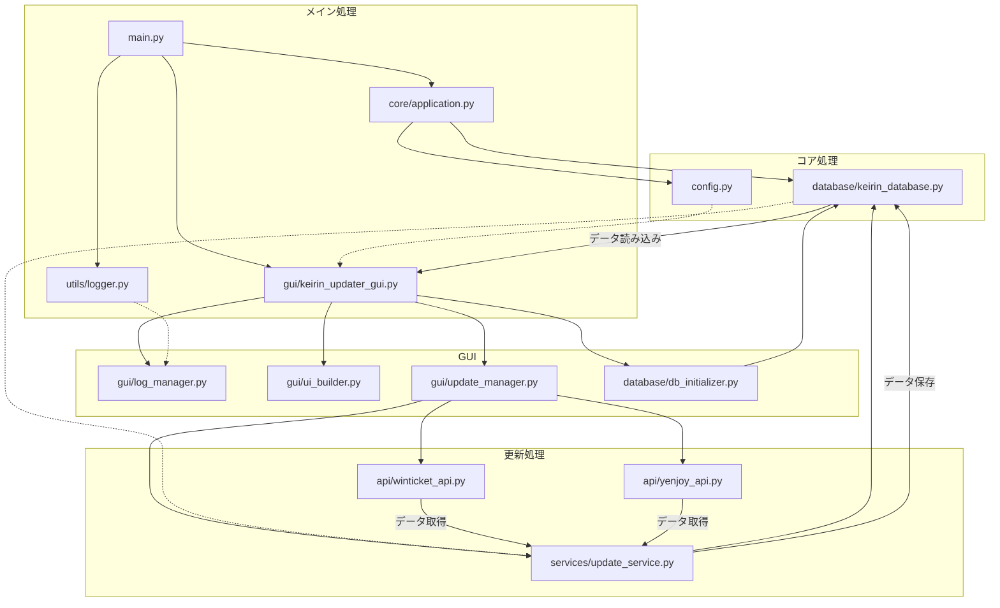

```mermaid
flowchart TB
    subgraph メイン処理
        main[main.py] --> logger[utils/logger.py]
        main --> core[core/application.py]
        main --> gui[gui/keirin_updater_gui.py]
    end
    
    subgraph コア処理
        core --> db[database/keirin_database.py]
        core --> config[config.py]
    end
    
    subgraph GUI
        gui --> log_manager[gui/log_manager.py]
        gui --> ui_builder[gui/ui_builder.py]
        gui --> update_manager[gui/update_manager.py]
        gui --> database_init[database/db_initializer.py]
        database_init --> db
    end
    
    subgraph 更新処理
        update_manager --> api1[api/winticket_api.py]
        update_manager --> api2[api/yenjoy_api.py]
        update_manager --> update_service[services/update_service.py]
        update_service --> db
    end
    
    %% コンポーネント間の関係
    logger -.-> log_manager
    db -.-> update_service
    config -.-> gui
    
    %% データフロー
    api1 --データ取得--> update_service
    api2 --データ取得--> update_service
    update_service --データ保存--> db
    db --データ読み込み--> gui
``` 