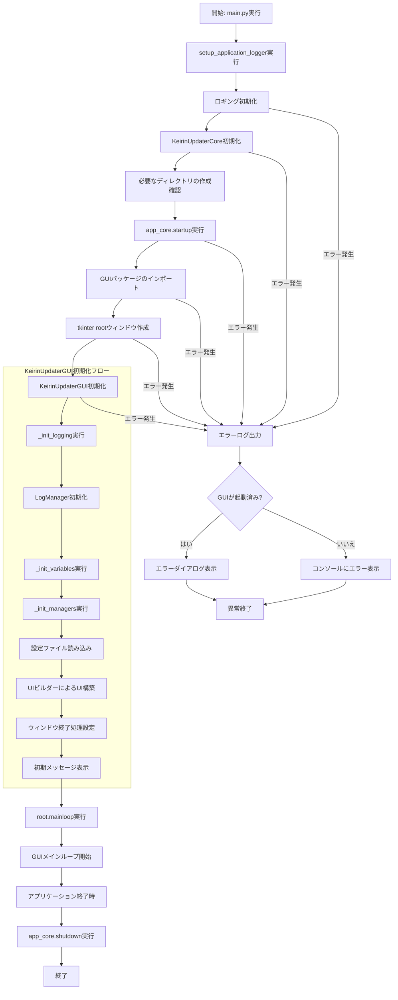

```mermaid
flowchart TB
    A[開始: main.py実行] --> B[setup_application_logger実行]
    B --> C[ロギング初期化]
    C --> D[KeirinUpdaterCore初期化]
    D --> E[必要なディレクトリの作成確認]
    E --> F[app_core.startup実行]
    F --> G[GUIパッケージのインポート]
    G --> H[tkinter rootウィンドウ作成]
    H --> I[KeirinUpdaterGUI初期化]
    
    subgraph KeirinUpdaterGUI初期化フロー
        I --> I1[_init_logging実行]
        I1 --> I2[LogManager初期化]
        I2 --> I3[_init_variables実行]
        I3 --> I4[_init_managers実行]
        I4 --> I5[設定ファイル読み込み]
        I5 --> I6[UIビルダーによるUI構築]
        I6 --> I7[ウィンドウ終了処理設定]
        I7 --> I8[初期メッセージ表示]
    end
    
    I8 --> J[root.mainloop実行]
    J --> K[GUIメインループ開始]
    K --> L[アプリケーション終了時]
    L --> M[app_core.shutdown実行]
    M --> N[終了]
    
    %% エラー処理パス
    C -- エラー発生 --> O[エラーログ出力]
    D -- エラー発生 --> O
    F -- エラー発生 --> O
    G -- エラー発生 --> O
    H -- エラー発生 --> O
    I -- エラー発生 --> O
    O --> P{GUIが起動済み?}
    P -- はい --> Q[エラーダイアログ表示]
    P -- いいえ --> R[コンソールにエラー表示]
    Q --> S[異常終了]
    R --> S
``` 