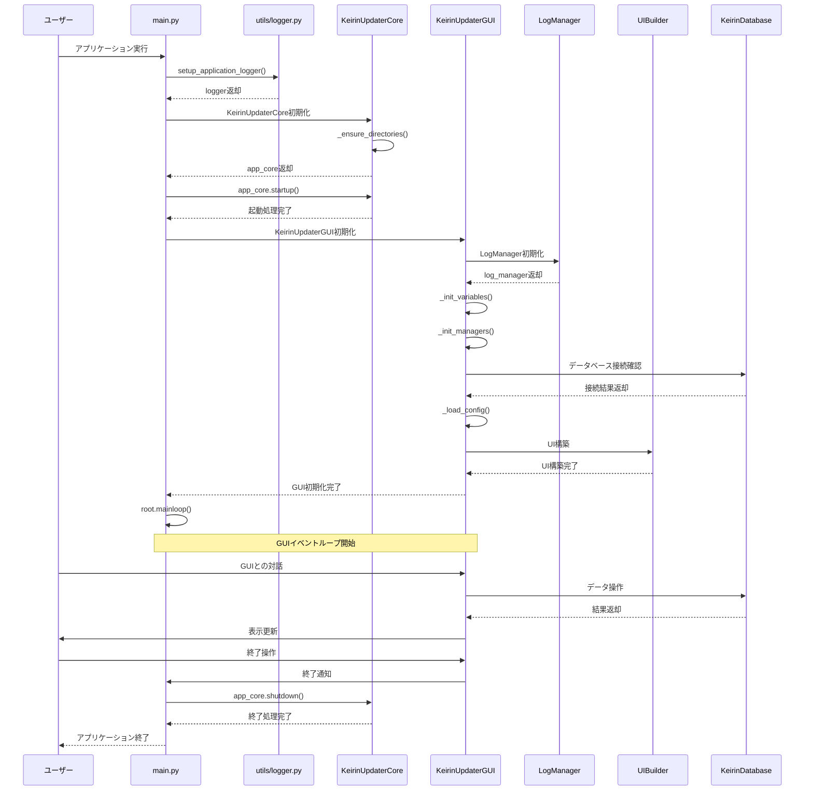

```mermaid
sequenceDiagram
    participant User as ユーザー
    participant Main as main.py
    participant Logger as utils/logger.py
    participant Core as KeirinUpdaterCore
    participant GUI as KeirinUpdaterGUI
    participant LogManager as LogManager
    participant UIBuilder as UIBuilder
    participant DB as KeirinDatabase
    
    User->>Main: アプリケーション実行
    Main->>Logger: setup_application_logger()
    Logger-->>Main: logger返却
    Main->>Core: KeirinUpdaterCore初期化
    Core->>Core: _ensure_directories()
    Core-->>Main: app_core返却
    Main->>Core: app_core.startup()
    Core-->>Main: 起動処理完了
    
    Main->>GUI: KeirinUpdaterGUI初期化
    GUI->>LogManager: LogManager初期化
    LogManager-->>GUI: log_manager返却
    GUI->>GUI: _init_variables()
    GUI->>GUI: _init_managers()
    GUI->>DB: データベース接続確認
    DB-->>GUI: 接続結果返却
    GUI->>GUI: _load_config()
    GUI->>UIBuilder: UI構築
    UIBuilder-->>GUI: UI構築完了
    GUI-->>Main: GUI初期化完了
    
    Main->>Main: root.mainloop()
    Note over Main,GUI: GUIイベントループ開始
    
    User->>GUI: GUIとの対話
    GUI->>DB: データ操作
    DB-->>GUI: 結果返却
    GUI->>User: 表示更新
    
    User->>GUI: 終了操作
    GUI->>Main: 終了通知
    Main->>Core: app_core.shutdown()
    Core-->>Main: 終了処理完了
    Main-->>User: アプリケーション終了
``` 