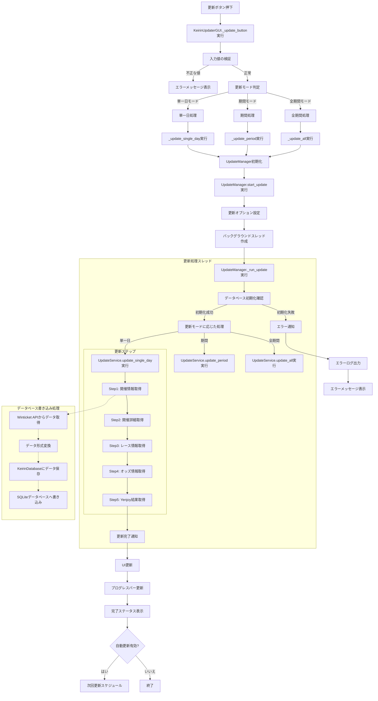

```mermaid
flowchart TB
    A[更新ボタン押下] --> B[KeirinUpdaterGUI._update_button実行]
    B --> C[入力値の検証]
    C -->|不正な値| D[エラーメッセージ表示]
    C -->|正常| E[更新モード判定]
    
    %% 更新モード判定
    E -->|単一日モード| F1[単一日処理]
    E -->|期間モード| F2[期間処理]
    E -->|全期間モード| F3[全期間処理]
    
    %% 更新マネージャー初期化と起動
    F1 --> G1[_update_single_day実行]
    F2 --> G2[_update_period実行]
    F3 --> G3[_update_all実行]
    
    G1 --> H[UpdateManager初期化]
    G2 --> H
    G3 --> H
    
    H --> I[UpdateManager.start_update実行]
    I --> J[更新オプション設定]
    J --> K[バックグラウンドスレッド作成]
    K --> L[UpdateManager._run_update実行]
    
    %% 更新処理の流れ
    subgraph 更新処理スレッド
        L --> M[データベース初期化確認]
        M -->|初期化失敗| N1[エラー通知]
        M -->|初期化成功| N2[更新モードに応じた処理]
        
        N2 -->|単一日| O1[UpdateService.update_single_day実行]
        N2 -->|期間| O2[UpdateService.update_period実行]
        N2 -->|全期間| O3[UpdateService.update_all実行]
        
        subgraph 更新ステップ
            O1 --> P1[Step1: 開催情報取得]
            P1 --> P2[Step2: 開催詳細取得]
            P2 --> P3[Step3: レース情報取得]
            P3 --> P4[Step4: オッズ情報取得]
            P4 --> P5[Step5: Yenjoy結果取得]
        end
        
        P5 --> Q[更新完了通知]
    end
    
    %% データ書き込み処理
    subgraph データベース書き込み処理
        P1 -.-> DB1[Winticket APIからデータ取得]
        DB1 -.-> DB2[データ形式変換]
        DB2 -.-> DB3[KeirinDatabaseにデータ保存]
        DB3 -.-> DB4[SQLiteデータベースへ書き込み]
    end
    
    %% 進捗通知処理
    Q --> R[UI更新]
    R --> S[プログレスバー更新]
    S --> T[完了ステータス表示]
    
    %% エラー処理
    N1 --> U[エラーログ出力]
    U --> V[エラーメッセージ表示]
    
    %% 自動更新処理（オプション）
    T --> W{自動更新有効?}
    W -->|はい| X[次回更新スケジュール]
    W -->|いいえ| Y[終了]
``` 