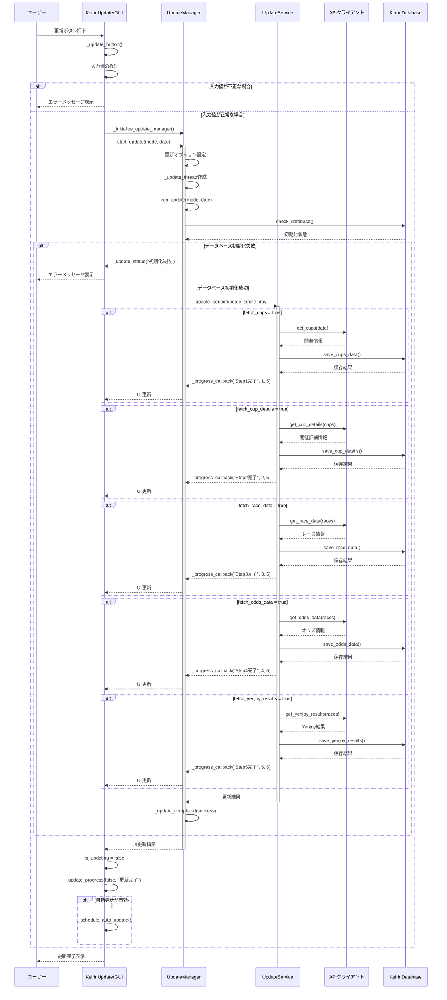

```mermaid
sequenceDiagram
    participant User as ユーザー
    participant GUI as KeirinUpdaterGUI
    participant UM as UpdateManager
    participant US as UpdateService
    participant API as APIクライアント
    participant DB as KeirinDatabase
    
    User->>GUI: 更新ボタン押下
    GUI->>GUI: _update_button()
    GUI->>GUI: 入力値の検証
    
    alt 入力値が不正な場合
        GUI-->>User: エラーメッセージ表示
    else 入力値が正常な場合
        GUI->>UM: _initialize_update_manager()
        GUI->>UM: start_update(mode, date)
        
        activate UM
        UM->>UM: 更新オプション設定
        
        %% スレッド作成とバックグラウンド実行
        UM->>UM: _update_thread作成
        UM->>UM: _run_update(mode, date)
        
        %% データベース初期化
        UM->>DB: check_database()
        DB-->>UM: 初期化状態
        
        alt データベース初期化失敗
            UM-->>GUI: _update_status("初期化失敗")
            GUI-->>User: エラーメッセージ表示
        else データベース初期化成功
            %% 更新サービス呼び出し
            UM->>US: update_period/update_single_day
            
            activate US
            
            %% Step1: 開催情報取得
            alt fetch_cups = true
                US->>API: get_cups(date)
                API-->>US: 開催情報
                US->>DB: save_cups_data()
                DB-->>US: 保存結果
                US-->>UM: _progress_callback("Step1完了", 1, 5)
                UM-->>GUI: UI更新
            end
            
            %% Step2: 開催詳細取得
            alt fetch_cup_details = true
                US->>API: get_cup_details(cups)
                API-->>US: 開催詳細情報
                US->>DB: save_cup_details()
                DB-->>US: 保存結果
                US-->>UM: _progress_callback("Step2完了", 2, 5)
                UM-->>GUI: UI更新
            end
            
            %% Step3: レース情報取得
            alt fetch_race_data = true
                US->>API: get_race_data(races)
                API-->>US: レース情報
                US->>DB: save_race_data()
                DB-->>US: 保存結果
                US-->>UM: _progress_callback("Step3完了", 3, 5)
                UM-->>GUI: UI更新
            end
            
            %% Step4: オッズ情報取得
            alt fetch_odds_data = true
                US->>API: get_odds_data(races)
                API-->>US: オッズ情報
                US->>DB: save_odds_data()
                DB-->>US: 保存結果
                US-->>UM: _progress_callback("Step4完了", 4, 5)
                UM-->>GUI: UI更新
            end
            
            %% Step5: Yenjoy結果取得
            alt fetch_yenjoy_results = true
                US->>API: get_yenjoy_results(races)
                API-->>US: Yenjoy結果
                US->>DB: save_yenjoy_results()
                DB-->>US: 保存結果
                US-->>UM: _progress_callback("Step5完了", 5, 5)
                UM-->>GUI: UI更新
            end
            
            US-->>UM: 更新結果
            deactivate US
            
            UM->>UM: _update_completed(success)
        end
        
        UM-->>GUI: UI更新指示
        deactivate UM
        
        GUI->>GUI: is_updating = false
        GUI->>GUI: update_progress(false, "更新完了")
        
        alt 自動更新が有効
            GUI->>GUI: _schedule_auto_update()
        end
    end
    
    GUI-->>User: 更新完了表示
``` 